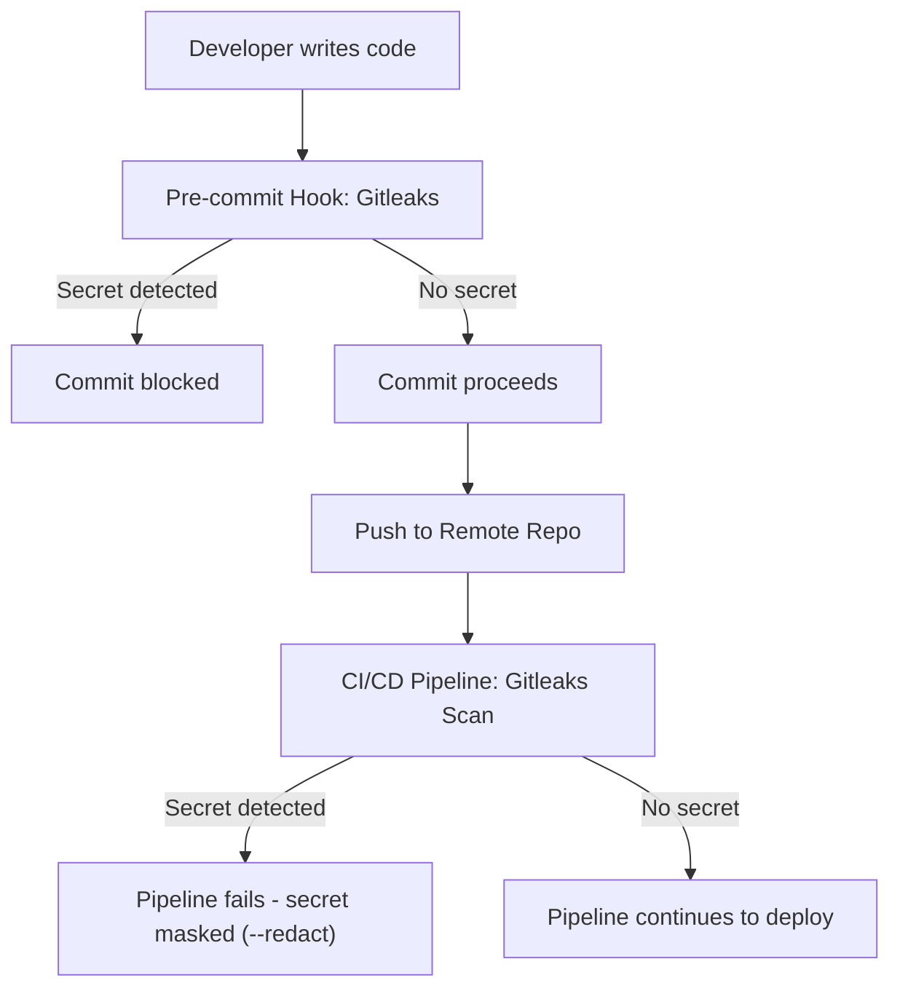

## Gitleaks: Secret Scanning & Pre-commit Hook

Gitleaks is a specialized SAST tool used to detect and prevent hardcoded secrets like passwords, API keys, and tokens in git repositories. By using it as a pre-commit hook, you ensure that sensitive data never leaves your local machine.

---

## 🛠 Local Setup (Pre-commit)

To implement filtering at the local level, follow these steps to set up the pre-commit framework.

### 1. Install Gitleaks & Pre-commit

```
# Install Gitleaks 
pip install gitleak

# Install Pre-commit framework
pip install pre-commit
```
### 2. Create Configuration File
```
Create a file named .pre-commit-config.yaml in the root of your sample_repo
repos:
  - repo: https://github.com/gitleaks/gitleaks
    rev: v8.18.2
    hooks:
      - id: gitleaks
```
### 3. Install the Hook
```
Run this command to activate the hook in your local .git directory:
pre-commit install
```
🔍 Usage Manual
- Automated Scanning:  
  Once installed, Gitleaks will run automatically every time you run git commit.
  If a secret is detected, the commit will be blocked.

-  Manual Local Scan:  
   To scan your staged changes manually before committing:
```   gitleaks detect --source . --verbose
```
Full History Scan: To check for leaks in the entire history of the repository:
```
gitleaks detect --source . --report-path leaks-report.json

🛡 Filtering & False Positives
   If Gitleaks flags a string that is not actually a secret, you can ignore it using a .gitleaksignore file.
   Copy the Fingerprint from the Gitleaks output.
   Add it to a .gitleaksignore file in your root directory:

# Ignore false positive in test file
  6dbda8c067d020d674996903f6560946:sample_repo/test.txt:1
```
### 🚀 DevSecOps Pipeline Integration
In addition to local hooks, Gitleaks should run in your devsecops.yaml to ensure a layered defense.
```
yaml
gitleaks_scan:
  stage: test
  image: 
    name: zricethezav/gitleaks:latest
    entrypoint: [""]
  script:
    - gitleaks detect --source . --verbose --redact
Note: The --redact flag ensures that if a secret is found, it is masked in the CI/CD logs to prevent further exposure.
```

📊 Comparison of Security Tools
| Tool     | Layer        | Focus                 |
|----------|--------------|-----------------------|
| Gitleaks | Local/Commit | Secrets & Credentials |
| tfsec    | Static Code  | Terraform Security    |
| Checkov  | Static Code  | General IaC Security  |


## 🔐 Gitleaks Workflow Diagram


# The Pipeline Lifecycle
  Here is exactly where it fits in the sequence:
  - Commit (Local): You run git commit. The pre-commit hook runs Gitleaks on your laptop.
  - Push: You run git push. The code travels to the server.
  - Pipeline Trigger: The server sees the new code and starts the devsecops.yaml pipeline.
  - Gitleaks Stage: The pipeline agent pulls the Gitleaks Docker image and scans the entire branch or the merge request.
  - Pass/Fail: * Success: If no secrets are found, the pipeline moves to the next stage (like terraform plan or tfsec).
  - Failure: If a secret is found, the pipeline stops immediately. It prevents the code from being merged or deployed.
## Note : Pipeline (GitHub Actions): Use TruffleHog. It acts as the final gate,Use Gitleaks as a pre-commit hook on local

#################################################################################################################   
## Golden Question: a technical limitation, Git hooks (like the pre-commit folder) are not part of the repository that gets pushed to GitHub.   
   When a developer clones a repo, their .git/hooks folder is empty. You cannot "force" the hooks onto their machine just by pushing code to GitHub.

As a DevSecOps Manager, here is how you solve this and enforce the standard: 
### 1. The "Configuration-as-Code" Strategy
 You don't push the hook itself; you push the instructions for the hook.You commit the .pre-commit-config.yaml file to the root of your sample_repo.
 This file is now "Source of Truth." Any engineer who clones the repo sees this file and knows exactly what checks are required.
### 2. The "Onboarding Script" (The Manager's Hammer)
 Since you can't force the install via Git, you automate it ia an onboarding script or the **preferred Industry Standard: a Makefile**. In your repo, 
 #### 2.1a you can create a setup.sh file:
```
#!/bin/bash
# setup.sh - Professional Onboarding Script
set -e  # Exit immediately if a command exits with a non-zero status
echo "Installing pre-commit framework..."
pip install pre-commit
echo "Linking Gitleaks hooks to local .git directory..."
pre-commit install
echo "✅ Gitleaks pre-commit hook is now active and ready!"
```
Maket it executable :  chmod +x setup.sh , Then run it : ./setup.sh

 #### 2.1b The "Industry Standard" (Makefile)
For a more standardized approach across all projects, use a `Makefile`. This allows engineers to use a single, memorable command.
Create a `Makefile` in the root directory:
```makefile
.PHONY: install-hooks
install-hooks:
	pip install pre-commit
	pre-commit install
	@echo "✅ Gitleaks pre-commit hook is now active!"

.PHONY: scan
scan:
	gitleaks detect --source . --verbose
```
### To use it, the engineer simply runs:
```
 make install-hooks
```
### 3. The "Trust but Verify" (The Pipeline Gate)
 This is where the Pipeline (GitHub Actions/TruffleHog) comes back into play. This is your enforcement mechanism.  
  -  Scenario A: Engineer A follows instructions, installs the hook. Gitleaks catches a secret locally. They fix it. No mess.  
  -  Scenario B: Engineer B is lazy, skips the hook, and tries to push a secret.  
  -  The Result: The Pipeline (using TruffleHog or Gitleaks) catches the secret on GitHub. The PR is blocked.
### 4. The Modern Solution: "Pre-commit CI"
There are tools that can actually check if the pre-commit hooks were run before a PR is allowed to merge. If the code format or security checks don't   match what the .pre-commit-config.yaml expects, the pipeline fails.
